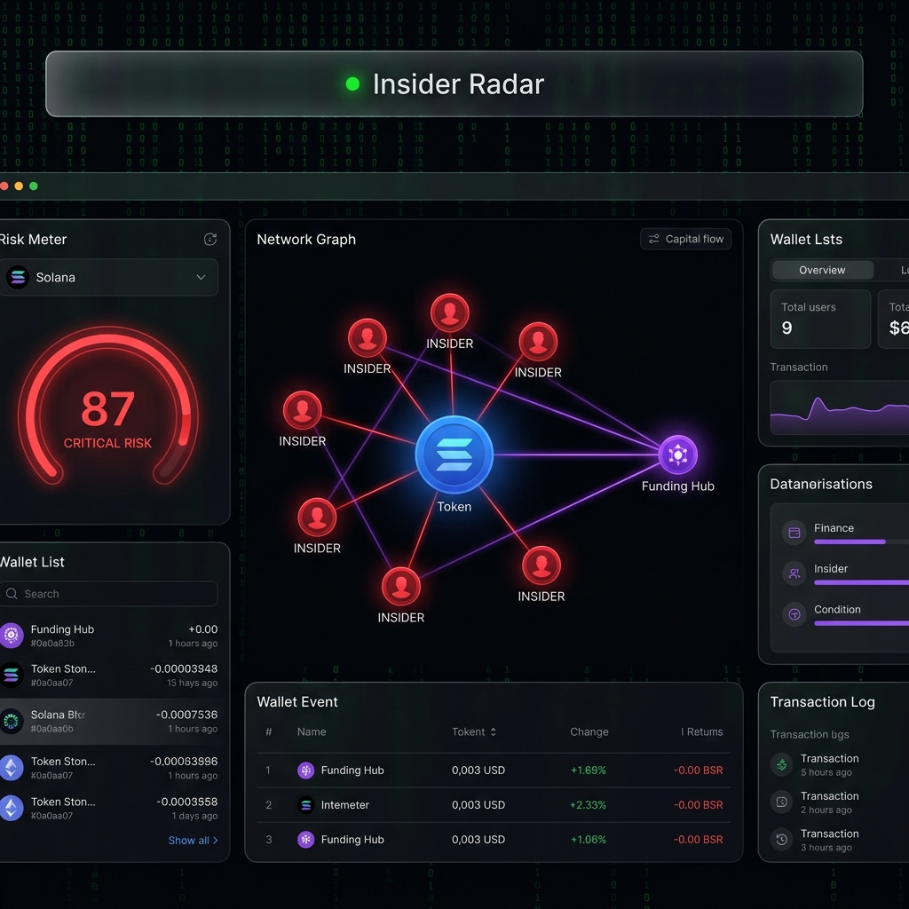

# 🔍 Find The Insiders — Solana On-Chain Intelligence

<p align="center">
  
</p>

<p align="center">
  
  
  
  
  
</p>

<p align="center">
  <strong>Trace block-0 buyers · Audit SOL funding chains · Identify coordinated insider clusters · Calculate risk scores</strong>
</p>

---

## 🎯 What Is This?

When a new Solana token launches, **developers and insiders** often use multiple freshly-created wallets to buy the token in the **first blocks (Block 0/1/2)** before the public can react. They fund these wallets from a single source (a DEX hot wallet, their own main wallet, or a CEX account) and then **dump their holdings** once enough retail buyers enter — leaving everyone else holding worthless tokens.

**Find The Insiders** is a dashboard that exposes this exact pattern by:

1. **Tracing block-0 buyer wallets** from the token's launch transaction history (via Helius RPC)
2. **Following the SOL funding trail** of each wallet to find their common origin
3. **Mapping connected clusters** in an interactive network graph so you can *see* who controls who
4. **Computing a 0–100 Insider Risk Score** combining multiple on-chain signals
5. **Flagging "Fresh" wallets** (wallets created hours before launch — a key insider signal)

---

## 🌟 Key Features

### 🕸️ Interactive Wallet Cluster Network Graph
An interactive, physics-based network graph powered by **Vis.js** that maps:
- 🔵 **Token Node** — the token being analyzed
- 🔴 **Insider Nodes** — wallets that bought in Block 0/1/2
- 🟢 **Holder Nodes** — regular organic buyers
- 🟣 **Funder Hubs** — the common source wallets that funded the insiders

If 7 wallets all point back to the same purple node, you're looking at a coordinated cluster.

### 🧮 Algorithmic Risk Score (0–100)
The score is calculated from 4 independent signals:

| Signal | Max Points | Description |
|:---|:---:|:---|
| Shared Funder Overlap | 30 | Multiple wallets funded from the same source |
| Block-0 Timing | Up to 40 | How many wallets bought in the very first block |
| Supply Concentration | Variable | What % of supply insiders hold combined |
| Fresh Wallet Ratio | 20 | % of early wallets that are newly created |

**Thresholds:**
- 🟢 `0–24` → **LOW RISK** — Organic distribution
- 🟡 `25–49` → **MEDIUM RISK** — Some suspicious signals
- 🟠 `50–74` → **HIGH RISK** — Clear insider patterns
- 🔴 `75–100` → **CRITICAL RISK** — Almost certainly dev manipulation

### 👶 Fresh Wallet Detector
If a wallet has **fewer than 10 total transactions in its entire lifetime**, it is flagged as `FRESH`. This is a key signal — insiders create throwaway wallets minutes before launch and never use them again.

### 🏦 CEX Hot Wallet Resolver
A built-in database maps known **Binance, Coinbase, Kraken, and Raydium authority addresses** to human-readable labels. Instead of seeing a cryptic address, you see `"Funded by Binance Hot Wallet 1"`.

### 📊 Real-Time Market Data (Free)
Connects to the **DexScreener API** (no API key required) to show:
- Live token price in USD
- 24-hour trading volume
- Total DEX liquidity
- Direct link to the DexScreener pair page

### 🛡️ Hybrid Simulation Mode
No Helius API key? No problem. The app automatically runs in **Hybrid Mode**:
- Fetches **real market data** (name, price, volume) from DexScreener
- Generates a **highly realistic simulated insider cluster** so you can test all features instantly without any configuration

---

## 📂 Project Structure

```
find-the-insiders/
├── backend/
│   ├── main.py              # FastAPI application
│   │   ├── fetch_dexscreener_data()    # Free market data endpoint
│   │   ├── generate_mock_analysis()    # Simulation fallback engine
│   │   ├── analyze_token_onchain()     # Live Helius RPC scanner
│   │   ├── GET /api/analyze/{address}  # Main analysis endpoint
│   │   └── GET /api/status             # Backend health check
│   ├── requirements.txt     # Python dependencies
│   └── .env.example         # Environment variable template
├── frontend/
│   ├── index.html           # Glassmorphism dashboard UI
│   ├── style.css            # Dark theme, neon accents, animations
│   └── app.js               # Vis.js graph renderer + API fetch logic
├── assets/
│   └── banner.png           # Project banner
└── run.py                   # One-click launcher script
```

---

## 🚀 Quick Start

### 1. Clone the Repository
```bash
git clone https://github.com/karidasd/find-the-insiders.git
cd find-the-insiders
```

### 2. Install Python Dependencies
```bash
pip install -r backend/requirements.txt
```

### 3. Launch (One Command)
```bash
python run.py
```

The launcher script will automatically:
- ✅ Start the **FastAPI backend** on port `8000`
- ✅ Start the **frontend web server** on port `3000`
- ✅ **Open your browser** to `http://localhost:3000`

---

## 🔑 Enable Live On-Chain Mode (Optional)

By default the app runs in simulation mode. To scan the **real Solana mainnet**:

1. Get a **free Helius API key** at [helius.dev](https://www.helius.dev/) (free tier: 100k credits/day)
2. Rename `backend/.env.example` to `backend/.env`
3. Paste your key:
   ```env
   HELIUS_API_KEY=your_helius_api_key_here
   ```
4. Restart the app with `python run.py`

The backend status badge in the header will switch to 🟢 **"Live Analysis Mode"**.

---

## 🔌 API Reference

### `GET /api/analyze/{token_address}`
Analyzes a Solana token for insider patterns.

**Request:**
```
GET http://localhost:8000/api/analyze/DezXAZ8z7PnrnRJjz3wXh3tRe6SgCDGdXcrUMxP8pump
```

**Response:**
```json
{
  "token_address": "DezXAZ8z7...",
  "name": "Bonk",
  "symbol": "BONK",
  "price_usd": 0.0000182,
  "volume_24h": 12400000,
  "liquidity_usd": 3800000,
  "risk_score": 72,
  "risk_level": "HIGH RISK",
  "wallets": [
    {
      "address": "Insid3xK...",
      "type": "Insider",
      "block_purchased": 0,
      "sol_spent": 1.24,
      "percentage_held": 3.45,
      "funding_source": "FunderHub...",
      "funding_amount": 2.0,
      "is_fresh_wallet": true,
      "wallet_tx_count": 3
    }
  ],
  "graph": {
    "nodes": [...],
    "edges": [...]
  },
  "mode": "simulated"
}
```

### `GET /api/status`
Returns the backend health and connection mode.

```json
{
  "status": "online",
  "helius_connected": false,
  "mode": "simulation-fallback"
}
```

---

## 🛠️ Tech Stack

| Layer | Technology | Purpose |
|:---|:---|:---|
| Backend | **FastAPI** (Python) | REST API server |
| On-Chain | **Helius RPC** | Solana transaction scanning |
| Market Data | **DexScreener API** | Token price & liquidity (free) |
| Frontend | **HTML/CSS/JS** (Vanilla) | No framework needed |
| Graph | **Vis.js** | Interactive physics network |
| Fonts | **Outfit + JetBrains Mono** | UI typography |
| Icons | **FontAwesome 6** | UI icons |

---

## ⚠️ Disclaimer

This tool is for **educational and research purposes only**. On-chain data is publicly available. The risk scores are algorithmic estimates and should not be used as financial advice. Always do your own research before investing in any cryptocurrency token.

---

## 📄 License

MIT License — Built by **[DARKAIS Data Science](https://karidasd.github.io/)** · 2026
